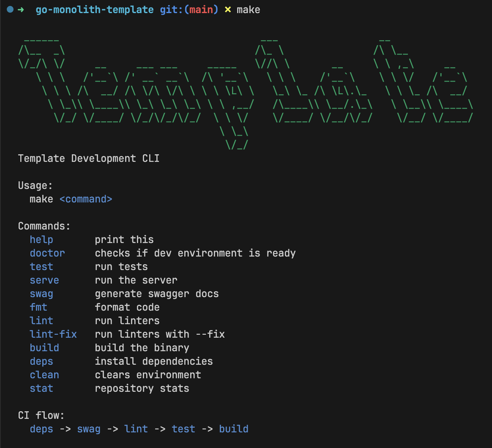

# Golang Monolith Template

<p align="center">
    
    <br/>
    <i>CLI interface</i>
</p>

## Features

- **Testing**: Run the test suite effortlessly with `make test`.

- **Linting**: Ensure clean and consistent code with `make lint`.

- **Building**: Compile your application into a binary using `make build`.

## Setup

1. **Configuration**:
    - Open the `.env` file and update the project name. If there's no `.env`, duplicate `.env.default`.
    - Modify the Go package name in `go.mod`. Resolve errors that may occur after this step.

2. **Initialization**:
    - Run the following command:
        ```sh
        make doctor
        ```

    This will guide you through the setup process.

3. **Command Reference**:
    - Explore the capabilities of the CLI by running:
        ```sh
        make
        ```
        It provides a concise overview of available commands.

## Directory Structure

- `cfg/`: Environment configuration.
- `cmd/`: Home to [Cobra](http://github.com/spf13/cobra-cli) CLI flags.
- `docs/`: [Swaggo](http://github.com/swaggo/swag) generated package.
- `internal/`: The core of your application.

## Contribution

Feel free to contribute, open issues, or suggest improvements.

## License

This project is licensed under the [MIT License](LICENSE).
